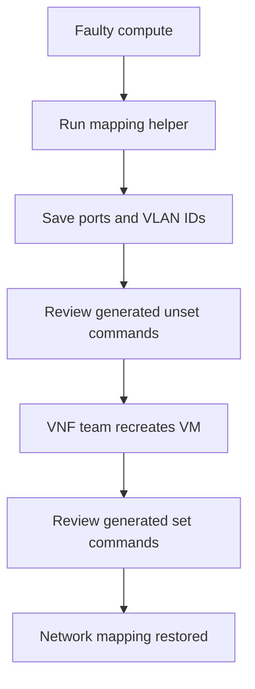

# OpenStack PFU Port Mapping & Recovery Helper

A read-only Bash automation that captures OpenStack trunk and subport details
and generates the exact `unset` and `set` commands required during PFU VM
recovery. It helps engineers preserve network mappings before a failed VM is
removed and reapply the same VLAN relationships after the VNF team recreates
the VM on a healthy compute node.

> The operational script is preserved exactly as provided. Documentation,
> synthetic fixtures, and a mock smoke test are added around it without changing
> its commands or logic.

## Operational problem

PFU VMs could not be moved through the normal migration workflow when their
compute node became faulty. Recovery required coordination between the cloud
infrastructure and VNF teams:

1. Record the existing parent/trunk ports, subport IDs, VLAN segmentation IDs,
   and detailed port configuration.
2. Unbind the subports from the trunk before the affected VM was removed.
3. Confirm the required cleanup from the infrastructure/controller side.
4. Ask the VNF team to recreate the VM on a healthy compute node.
5. Restore the original trunk/subport VLAN relationships manually.

A PFU workload could involve approximately eight subports plus parent and trunk
ports. Copying multiple UUIDs and segmentation IDs manually was slow and easy
to get wrong. Any missed or transposed value delayed network restoration,
extended the outage, and increased MTTR.

## Solution

The script accepts a case-insensitive trunk-name pattern and:

- Finds every matching OpenStack network trunk.
- Retrieves the trunk name and identifier.
- Extracts every subport ID and VLAN segmentation ID.
- Displays full `openstack port show` details for preservation.
- Generates an individual `unset` and `set` command beside each subport.
- Produces clean grouped command summaries for the recovery procedure.

The tool intentionally **does not execute** the generated change commands. An
engineer can review, save, and execute them at the correct approved stage of the
recovery workflow.

## Recovery workflow



## Repository contents

| Path | Purpose |
|---|---|
| `pfu_port_mapping_helper.sh` | Executable copy of the original script |
| `original/pfu_port_mapping_script.txt` | Preserved original code |
| `tests/mock-bin/openstack` | Synthetic OpenStack CLI fixture |
| `tests/smoke_test.sh` | Tests generated commands without production access |
| `sample-output/pfu-mapping.synthetic.txt` | Non-production example transcript |
| `docs/recovery-runbook.md` | Human-reviewed operational sequence |

CI verifies that the executable and preserved copies remain identical.

## Requirements

- Bash
- Authenticated OpenStack CLI environment
- Permission to list/show network trunks and ports
- Standard `grep`, `awk`, and `sed` utilities

## Usage

```bash
chmod +x pfu_port_mapping_helper.sh
./pfu_port_mapping_helper.sh '<trunk-name-pattern>'
```

Example using a synthetic pattern:

```bash
./pfu_port_mapping_helper.sh 'pfu-demo'
```

If no pattern is supplied, the original script prints:

```text
Usage: ./pfu_port_mapping_helper.sh <grep-pattern>
```

## Safety

- The script performs only list/show operations and prints proposed commands.
- Review every generated command and the active OpenStack project before use.
- Save the full output before any port or VM removal activity.
- Follow the approved MOP/change process and coordinate with the VNF team.
- Validate VM connectivity after mappings are restored.

## Demonstration

The smoke test places a synthetic `openstack` executable earlier in `PATH`, runs
the unchanged script, and confirms that it produces the expected trunk,
subport, VLAN, unset, and set lines. It makes no network calls and changes no
resources.

```bash
bash tests/smoke_test.sh
```

## Impact

- Reduced manual transcription across multiple ports and approximately eight
  subports per workload.
- Reduced the chance of losing UUID-to-VLAN relationships during recovery.
- Produced reusable recovery commands before destructive work began.
- Improved coordination between infrastructure and VNF teams.
- Reduced the previously documented recovery time from approximately one hour
  to ten minutes, lowering outage duration and MTTR.

## Technologies

Bash, OpenStack CLI, Neutron networking, trunk ports, VLAN segmentation,
`grep`, `awk`, `sed`

## Confidentiality

All identifiers and output in this repository are synthetic. Do not commit real
tenant names, project names, VM details, UUIDs, VLAN assignments, controller
output, customer information, or credentials.

## License

[MIT](LICENSE)
